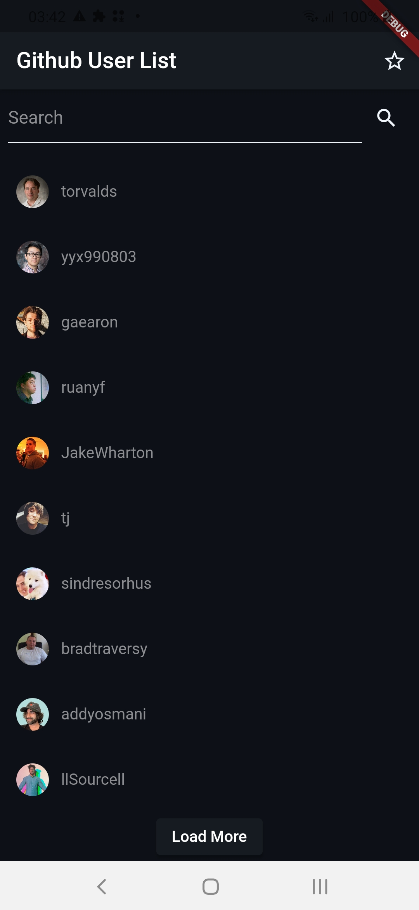
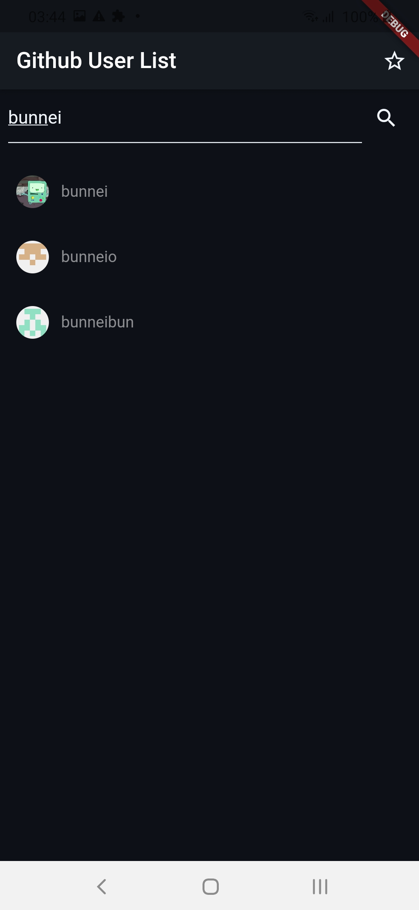
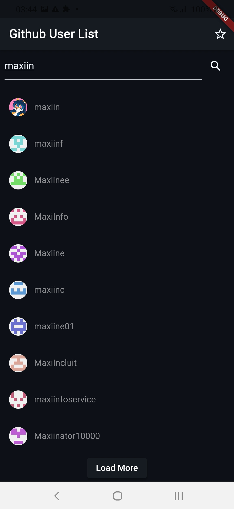
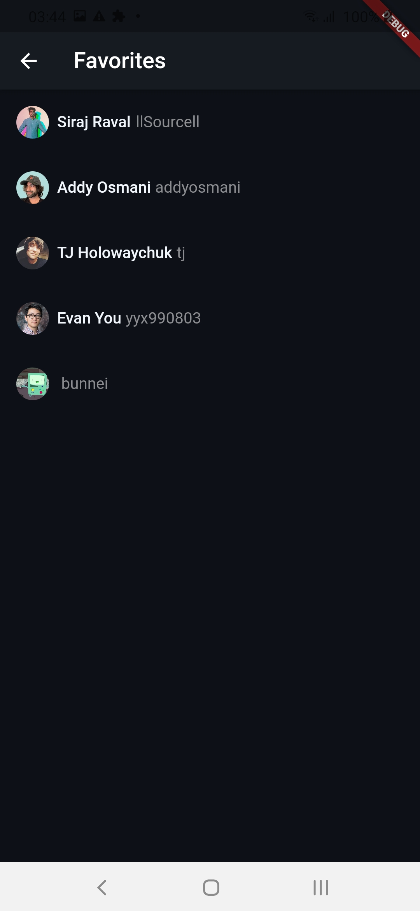
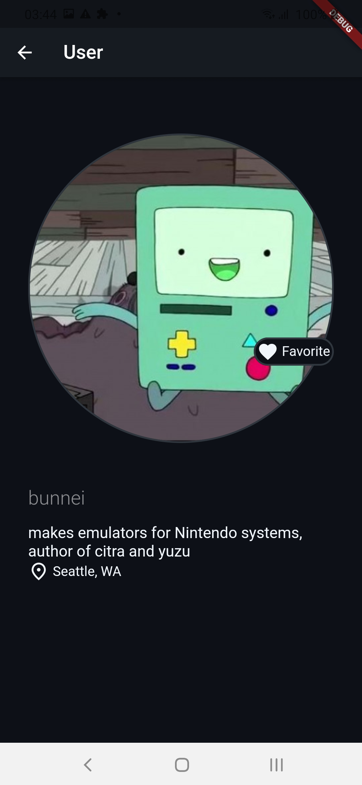

# Mobile Challenge

## Objetivos Cumpridos

### Funcionais

✔️ Permitir a pesquisa dos usuário do GitHub. Os resultados devem ser exibidos em uma lista

✔️ Permitir visualizar as seguintes informações dos usuários encontrados: Avatar, login

✔️ Permitir a visualização as informações de um usuário selecionado:
  ✔️ Avatar,
  ✔️ localização,
  ✔️ bio,
  ✔️ nickname,
  ⚠️ e-mail. (A informação de email de usuário não apareceu em meus testes comuns, é possivel que seja necessário o uso de uma api key)
  
✔️ Permitir favoritar os usuários do GitHub

✔️ Permitir visualizar os itens favoritados de forma offline ✔️ Imagens de perfil são salvas em cache

### Técnicos

✔️ Clean Architecture 
  
  Separados em 
   - Presentation | 
        - Page (Widget principal)
        - Widgets (Pequenos Widgets específicos para page, mas repetitivos) 
        - State Management (Bloc nesse caso, utilizado para mudar os estados visuais da pagina)
   - Domain | 
        - Use Cases (usados para ditar os parâmetros ou funções necessarias para uma ação vinda da página para a ação do repositório)
   - Data |
        - Repositories (usados para converter o resultado dos modelos vindos os Data Sourcers para Modelos que serão usados pela Página)
        - Models (Modelos de Objeto da maneira entregue pelo backend)
        - Data Sources (Funções que conectam com o backend e transformam sua resposta em Modelos)

  ⚠️ Alguns arquivos foram usados em Shared, estes foram usados por varios repositorios diferentes, há a possibilidade de ambos: tirar todos os Data Sources de seus módulos ou deixar que qualquer repositorio acesse qualquer modulo, foi usada um método misto nesse projeto para demonstrar como pode ser feito.
  
✔️ Tratamento de erros (Foram feitos resultados visuais e Exceptions customizadas para os erros do app)

✔️ Testes unitários (Foram feitos 8 testes unitários testando a resposta de api e resolução de erro com dados mocados)

## Visual do app

Aqui estão algumas prints tiradas do app

Default Loading List       | Pesquisa 1                 | Pesquisa 2                
:-------------------------:|:--------------------------:|:-------------------------:
      |   |  

Favorites                  | User 1                     | User 2                
:-------------------------:|:--------------------------:|:-------------------------:
     |      |  
